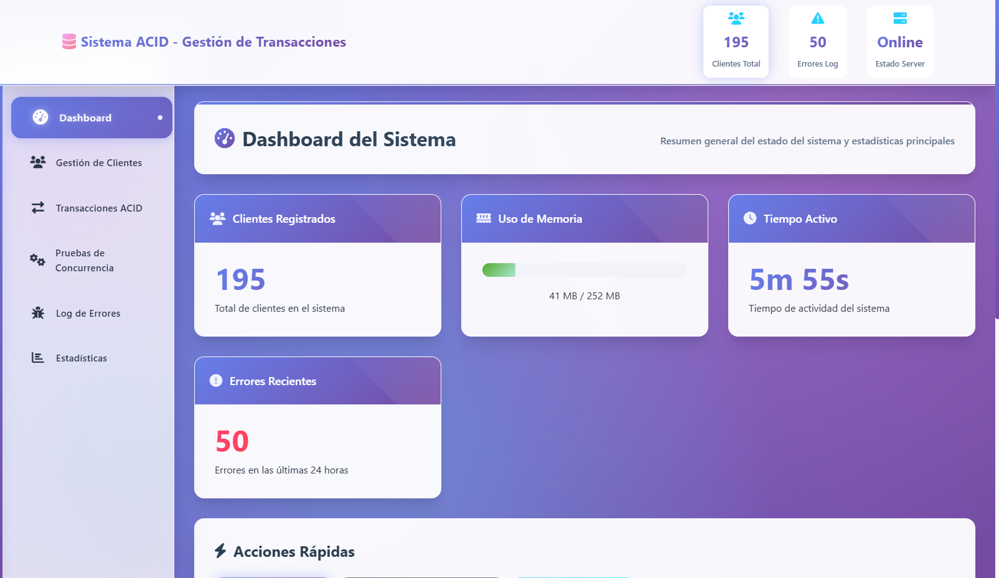

# 🎯 Sistema de Gestión de Transacciones ACID

## 📋 Descripción

Sistema completo de gestión de transacciones de base de datos que demuestra las propiedades **ACID** (Atomicidad, Consistencia, Aislamiento, Durabilidad) con interfaz web moderna y pruebas de concurrencia.

## ✨ Características Principales

### 🔧 Backend (Java)
- **Gestión de Clientes**: CRUD completo con transacciones ACID
- **Pool de Conexiones**: Gestión eficiente de conexiones PostgreSQL
- **Transacciones Seguras**: Implementación de SAVEPOINT, ROLLBACK y COMMIT
- **Pruebas de Concurrencia**: Simulación de múltiples usuarios simultáneos
- **Log de Errores**: Registro detallado de errores transaccionales
- **API REST**: Endpoints para integración con frontend

### 🎨 Frontend (Web)
- **Interfaz Moderna**: Diseño responsive con CSS Grid y Flexbox
- **Dashboard Interactivo**: Estadísticas en tiempo real
- **Gestión Visual**: CRUD de clientes con formularios dinámicos
- **Pruebas ACID**: Simulación visual de propiedades ACID
- **Monitor de Concurrencia**: Ejecución de pruebas de múltiples hilos
- **Log de Errores**: Visualización de errores en tiempo real

## 🛠️ Tecnologías Utilizadas

### Backend
- **Java 11+**: Lenguaje principal
- **PostgreSQL**: Base de datos relacional
- **JDBC**: Conectividad a base de datos
- **Gson**: Serialización JSON
- **HttpServer**: Servidor web integrado

### Frontend
- **HTML5**: Estructura semántica
- **CSS3**: Estilos modernos con variables CSS
- **JavaScript ES6+**: Lógica del cliente
- **Font Awesome**: Iconografía
- **Fetch API**: Comunicación con backend

## 📦 Estructura del Proyecto

```
actividad2_java_tatiana/
├── src/
│   └── com/puce/
│       ├── Main.java                 # Punto de entrada
│       ├── config/
│       │   └── DatabaseConfig.java   # Configuración BD
│       ├── dao/
│       │   ├── ClienteDAO.java       # Acceso a datos
│       │   └── ErrorLogDAO.java      # Log de errores
│       ├── model/
│       │   ├── Cliente.java          # Modelo de datos
│       │   └── LogError.java         # Modelo de errores
│       ├── service/
│       │   ├── ClienteService.java   # Lógica de negocio
│       │   └── ConcurrencyTest.java  # Pruebas concurrencia
│       └── web/
│           ├── WebServer.java        # Servidor HTTP
│           ├── ClienteApiHandler.java# API Clientes
│           ├── ErrorApiHandler.java  # API Errores
│           ├── StatsApiHandler.java  # API Estadísticas
│           └── ConcurrencyApiHandler.java # API Concurrencia
├── web/
│   ├── index.html                    # Frontend principal
│   ├── styles.css                    # Estilos CSS
│   └── script.js                     # Lógica JavaScript
├── lib/
│   ├── postgresql-42.7.7.jar        # Driver PostgreSQL
│   └── gson-2.10.1.jar              # Librería JSON
└── compilar_y_ejecutar.bat          # Script de ejecución
```

## 🚀 Instalación y Configuración

### 1. Prerrequisitos
- **Java 11+** instalado y configurado en PATH
- **PostgreSQL** instalado y ejecutándose
- **Base de datos creada** (ver configuración abajo)

### 2. Configuración de Base de Datos

```sql
-- Crear base de datos
CREATE DATABASE actividad2_acid;

-- Usar la base de datos
\c actividad2_acid;

-- Las tablas se crean automáticamente al ejecutar la aplicación
```

### 3. Configuración de Conexión

Editar `src/com/puce/config/DatabaseConfig.java`:

```java
private static final String URL = "jdbc:postgresql://localhost:5432/actividad2_acid";
private static final String USER = "tu_usuario";
private static final String PASSWORD = "tu_password";
```

### 4. Ejecución

#### Opción 1: Script Automático (Recomendado)
```bash
# En Windows
./compilar_y_ejecutar.bat
```

#### Opción 2: Manual
```bash
# Compilar
javac -cp "lib\postgresql-42.7.7.jar;lib\gson-2.10.1.jar" -d bin -sourcepath src src\com\puce\Main.java src\com\puce\**\*.java

# Ejecutar
java -cp "bin;lib\postgresql-42.7.7.jar;lib\gson-2.10.1.jar" com.puce.Main
```

## 💻 Modos de Ejecución

Al iniciar la aplicación, tienes 3 opciones:

### 1. **Interfaz de Consola** (Tradicional)
- Menú interactivo en terminal
- Gestión completa de clientes
- Pruebas de concurrencia
- Visualización de estadísticas

### 2. **Servidor Web + Interfaz Web**
- Servidor HTTP en puerto 8080
- Interfaz web moderna
- API REST completa
- Acceso en: `http://localhost:8080`

### 3. **Modo Híbrido** (Ambos)
- Consola + Web simultáneamente
- Máxima flexibilidad
- Ideal para desarrollo y testing

## 🎯 Funcionalidades ACID Demostradas

### 🔄 **Atomicidad**
- Transacciones "todo o nada"
- Rollback automático en errores
- SAVEPOINT para rollbacks parciales

### ⚖️ **Consistencia**
- Validación de integridad referencial
- Constraints de base de datos
- Validaciones de negocio

### 🛡️ **Aislamiento**
- Niveles de aislamiento configurables
- Pruebas de concurrencia
- Prevención de lecturas sucias

### 💾 **Durabilidad**
- Commits persistentes
- Write-Ahead Logging (WAL)
- Recuperación ante fallos

## 🧪 Pruebas de Concurrencia

### Tipos de Pruebas Disponibles:

1. **Inserciones Concurrentes**
   - 20 hilos insertando simultáneamente
   - 5 clientes por hilo
   - Medición de tasa de éxito

2. **Lecturas Concurrentes**
   - 50 hilos leyendo simultáneamente
   - 10 lecturas por hilo
   - Sin bloqueos

3. **Actualizaciones Concurrentes**
   - 10 hilos actualizando
   - Control de versiones
   - Detección de conflictos

4. **Operaciones Mixtas**
   - Combinación de INSERT/UPDATE/SELECT
   - Estrés real del sistema
   - Análisis de rendimiento

## 🌐 API REST Endpoints

### Clientes
- `GET /api/clientes` - Listar todos los clientes
- `GET /api/clientes/{id}` - Obtener cliente por ID
- `POST /api/clientes` - Crear nuevo cliente
- `PUT /api/clientes/{id}` - Actualizar cliente
- `DELETE /api/clientes/{id}` - Eliminar cliente

### Estadísticas
- `GET /api/stats` - Estadísticas del sistema

### Errores
- `GET /api/errores` - Log de errores recientes

### Concurrencia
- `POST /api/concurrency/test-inserts` - Prueba de inserciones
- `POST /api/concurrency/test-updates` - Prueba de actualizaciones
- `POST /api/concurrency/test-mixed` - Prueba mixta
- `POST /api/concurrency/test-transactions` - Prueba ACID

## 📊 Monitoreo y Logs

### Dashboard Web
- **Contador de Clientes**: Total registrados
- **Uso de Memoria**: RAM del sistema
- **Tiempo Activo**: Uptime del servidor
- **Errores Recientes**: Últimas 24 horas

### Logs de Errores
- **Timestamp**: Fecha y hora exacta
- **Tipo**: Categoría del error
- **Descripción**: Detalle del problema
- **Stack Trace**: Traza completa
- **Operación**: Contexto del error

## 🔧 Configuración Avanzada

### Pool de Conexiones
```java
// En DatabaseConfig.java
private static final int POOL_SIZE = 20;
private static final int MAX_WAIT_TIME = 30000; // 30 segundos
```

### Niveles de Aislamiento
```java
// Configurables por transacción
Connection.TRANSACTION_READ_COMMITTED
Connection.TRANSACTION_SERIALIZABLE
```

## 🐛 Solución de Problemas

### Error de Conexión a BD
```
Solución: Verificar que PostgreSQL esté ejecutándose
Comando: pg_ctl status
```

### Puerto 8080 ocupado
```
Solución: Cambiar puerto en WebServer.java
private static final int PORT = 8081;
```

### OutOfMemoryError
```
Solución: Aumentar memoria JVM
java -Xmx2g -cp ...
```

## 📈 Métricas de Rendimiento

### Benchmarks Típicos
- **Inserciones**: ~1000 ops/seg
- **Lecturas**: ~5000 ops/seg  
- **Actualizaciones**: ~800 ops/seg
- **Transacciones mixtas**: ~600 ops/seg

## 👥 Equipo de Desarrollo

- **Backend**: Arquitectura Java con JDBC
- **Frontend**: HTML5/CSS3/JavaScript
- **Base de Datos**: PostgreSQL con optimizaciones
- **Testing**: Pruebas de concurrencia automatizadas

## 📝 Licencia

Proyecto académico - Universidad PUCE
Actividad 2: Sistemas de Gestión de Transacciones ACID

---

## Foto de la aplicacion



## 🎉 ¡Listo para usar!

1. Configura tu base de datos PostgreSQL
2. Ejecuta `compilar_y_ejecutar.bat`
3. Elige el modo de ejecución
4. ¡Explora las transacciones ACID!

**💡 Tip**: Para la mejor experiencia, usa el modo 2 (Servidor Web) y abre `http://localhost:8080` en tu navegador. 